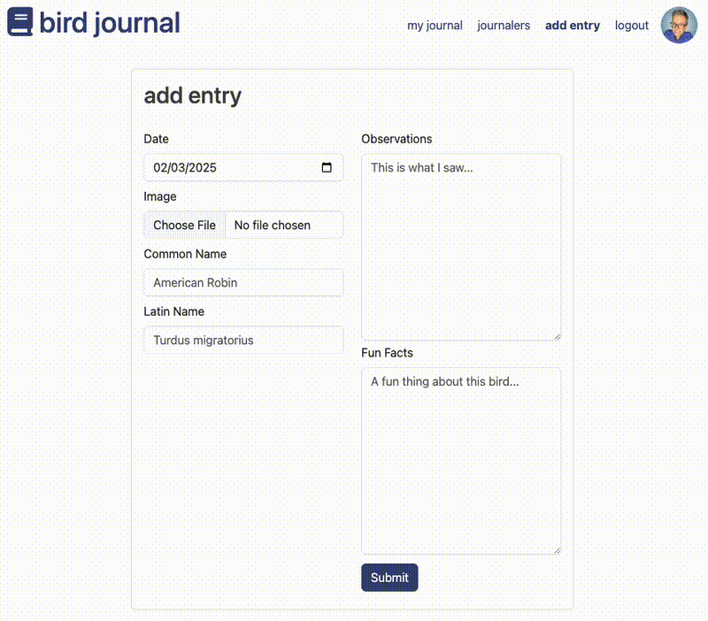

# Bird Journal
This is an application for tracking your observations in the wild. When you upload a photo you have the option of getting suggestions for the bird's Common Name, Latin Name an a fun fact using AI.

[Live Project](https://bird-journal.onrender.com/)

## How It's Made:
This is a node.js/Express API, using EJS templates and a MongoDB database. I built this for [#100devs](https://100devs.org/about).

I originally had all my application logic in server.js but I separated the logic based on MVC architecture.

### Tech Used:
- Javascript
- node.js
- Express
- EJS
- MongoDB
- Mongoose
- Cloudinary
- Multer
- Passport
- Gemini Flash 1.5 API

## Optimizations
- Use a middleware to compress large photos
- Use a WYSIWYG editor for entering observations
- Add a list of other posts about the same bird on the entry page
- Add the ability to have "friends" on the app with shortcuts to their posts
- Add ability to post multiple photos

## Lessons Learned
### CRUD
I learned about implementing the CRUD operations in a full stack web application.

### .env
The .env file is where you hide secrets and keys that should not be exposed to the public.

### MongoDB & Mongoose
I learned about connecting to MongoDB and Mongoose to simplify access the database.

I learned how to use different names for your collections inside the application.

The userId on an entry should be the data type "ObjectId".

### Cloudinary
I learned how to utilize Cloudinary for image hosting.

## Related Projects
<table border="1">
  <tr>
    <td style="text-align: center;"><a href="https://heidi37.pythonanywhere.com/">Let's Do Brunch App</a> | <a href="https://github.com/heidi37/cs50-final-project">Repo</a></td>
  </tr>
  <tr>
    <td></td>
  </tr>
</table>

<table border="1">
  <tr>
    <td style="text-align: center;"><a href="https://heidifryzell.com">My Portfolio</a> | <a href="https://github.com/heidi37/my-python-portfolio">Repo</a></td>
  </tr>
  <tr>
    <td></td>
  </tr>
</table>