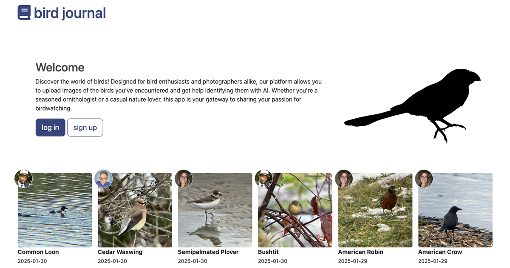

# Nature Journal
This is an application for tracking your observations in the wild.

Until I have authentication set up I am not going to post the link to the application.

Here is a Work In Progress Screenshot. I will be improving the design.

## How It's Made:
This is a node.js/Express API, using EJS templates and a MongoDB database. I built this for [#100devs](https://100devs.org/about).

I originally had all my application logic in server.js but I separated the logic based on MVC architecture.

### Tech Used:
- Javascript
- node.js
- Express
- EJS
- MongoDB
- [render.com](https://render.com/) free hosting

## Optimizations
It is in very early stage development. It needs a lot! 😁
- manage CRUD with mongoDB Ids
- Authentication

## Lessons Learned
I learned about implementing the CRUD operations in a full stack web application.

I also learned about environment variables.

I learned about connecting to MongoDB and I had issues because my collection had a different name than what I was calling it in my app so I learned how to use different names for your collections inside the application. Also in your connection string you need to make sure that you specify the database name. Specifying the cluster is not required. I think that was causing a lot of issues querying the specific collection. Also along the way I somehow generate a test database with a "birds" and "entries" collection. I think this again was because my connect string wasn't quite right.

## Related Projects
Here is another very simple web application that accesses a static API that I built for learning purposes:
https://heidifryzell.com/what-bird/

NOTE: The *What Bird* web application is hosted on free web hosting and may take up to a minute to spin up when you fill the form and make a request.